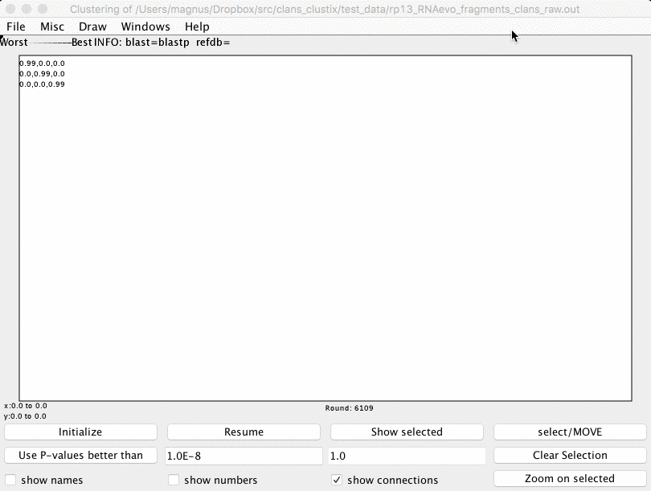

rnastruc_clanstix
-------------------------------------------------------------------------------

A tool for visualizing RNA 3D structures based on pairwise structural similarity.

The RMSDs between structures are converted into p-values based on the method from the Dokholyan lab.

Hajdin, C. E., Ding, F., Dokholyan, N. V, & Weeks, K. M. (2010). On the significance of an RNA tertiary structure prediction. RNA (New York, N.Y.), 16(7), 1340–9. doi:10.1261/rna.1837410

INSTALL

    git clone --recursive  git@github.com:m4rx9/rnastruc_clanstix.git
	$ ./test.sh
	rnastruc_clanstix.py
	------------------------------------------------------------
	input test_data/matrix.txt
	clans_run.txt generated